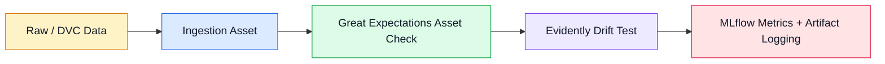

# professional-data-pipeline

> A modern data pipeline template for ingesting daily data, validating quality rules, and monitoring drift with MLflow. 🚀

---

## ✨ Overview

This repository contains a compact but production-oriented data pipeline built with **Dagster**, **DVC**, **Great Expectations**, **Evidently**, and **MLflow**.

The current implementation focuses on three core stages:

1. **Data ingestion** from a DVC-backed source.
2. **Data quality checks** with Great Expectations.
3. **Drift monitoring** with Evidently and experiment logging in MLflow.

The pipeline is designed to work with daily apartment/rental-style tabular data, where fields such as `price` and `habitaciones` are validated before the data is accepted for monitoring.

---

## 🧭 What This Project Does

- Loads the latest dataset from a remote or local DVC source.
- Keeps track of the source path and the Git revision used for ingestion.
- Validates minimum data quality expectations before downstream processing.
- Compares current data against a reference dataset to detect drift in the `price` column.
- Logs drift metrics and HTML reports to MLflow for traceability.

---

## 📈 Pipeline Flow



### Execution order

| Step | Component | Purpose |
| --- | --- | --- |
| 1 | `ingested_today_data` | Reads today’s dataset from the configured DVC path. |
| 2 | `check_ingested_data` | Verifies quality rules such as valid `price` and `habitaciones` values. |
| 3 | `radar_price` | Runs a drift test against the reference dataset and logs the result. |

---

## 🧱 Project Structure

```text
.
├── Makefile
├── pyproject.toml
├── README.md
├── .env.example
├── data/
└── src/
	└── pipeline.py
```

### Key files

- `src/pipeline.py`: core Dagster assets and checks.
- `.env.example`: sample environment variables required by the pipeline.
- `Makefile`: formatting helpers for the codebase.
- `pyproject.toml`: Python dependency and project metadata.

---

## 🛠️ Tech Stack

- **Python 3.12**
- **Dagster** for asset-based pipeline orchestration
- **DVC** for versioned data access
- **Great Expectations** for validation rules
- **Evidently** for drift detection
- **MLflow** for metrics and artifact tracking
- **Pandas** and **NumPy** for tabular data handling

---

## 🚀 Getting Started

### 1) Create and activate your environment

Use the environment manager you prefer. The project is configured for Python 3.12 and includes a `uv.lock` file, so `uv` is a natural fit if you are already using it.

### 2) Install dependencies

Make sure the project dependencies from `pyproject.toml` are installed in your environment.

### 3) Configure environment variables

Copy `.env.example` to `.env` and fill in the values for your setup.

### 4) Provide the datasets

The pipeline expects:

- a current data file, typically `data/today_data.csv`
- a reference data file, typically `data/reference_data.csv`
- a Git repository URL if you want `dvc.api.open` to read from a remote source

---

## ⚙️ Environment Variables

| Variable | Required | Default | Description |
| --- | --- | --- | --- |
| `RAW_DATA_PATH` | No | `data/today_data.csv` | Path to the daily dataset used for ingestion. |
| `GIT_REPO_URL` | Yes for remote DVC access | None | Repository URL used by `dvc.api.open`. |
| `REFERENCE_DATA_PATH` | No | `data/reference_data.csv` | Path to the baseline dataset used for drift comparison. |
| `MLFLOW_TRACKING_URI` | No | `http://localhost:5000` | MLflow tracking server URL. |
| `MLFLOW_EXPERIMENT_NAME` | No | `Price_Drift_Checks` | MLflow experiment name used for drift runs. |

Example `.env`:

```env
RAW_DATA_PATH=data/today_data.csv
GIT_REPO_URL=https://github.com/your-org/your-data-repo.git
REFERENCE_DATA_PATH=data/reference_data.csv
MLFLOW_TRACKING_URI=http://localhost:5000
MLFLOW_EXPERIMENT_NAME=Price_Drift_Checks
```

---

## 🔍 Validation Rules

The current quality gate enforces these expectations:

- `price` must be greater than or equal to `100.0`
- `price` must be stored as `float64`
- `habitaciones` must be greater than or equal to `1`

If a check fails, the pipeline raises an error and stops the run.

---

## 📊 Monitoring and Drift Detection

The monitoring asset runs an Evidently test suite focused on drift in the `price` column.

What happens during the run:

- the reference dataset is loaded from `REFERENCE_DATA_PATH`
- the current daily dataset is compared against the reference data
- the drift score and detection flag are logged to MLflow
- an HTML report is generated and stored as an MLflow artifact

This makes it easy to review both the numeric result and the visual report after each run.

---

## ▶️ Available Commands

### Format the codebase

```bash
make lint
```

The `lint` target currently runs:

- `isort src`
- `black src`

---

## 🧩 Notes on the Current Implementation

- The repository currently exposes Dagster assets and an asset check, but no full Dagster job or deployment entrypoint is defined yet.
- The `data/` directory is intentionally empty in the repository because the pipeline is expected to read data through DVC-backed sources or local files provided at runtime.
- The MLflow report is generated as a temporary HTML file and then cleaned up after the artifact is logged.

---

## 💡 Why This Project Matters

This project is a practical foundation for a data quality and monitoring workflow. It combines versioned data access, rule-based validation, and drift observability in a way that can be extended into a production-ready pipeline with orchestration, alerting, and model governance.
